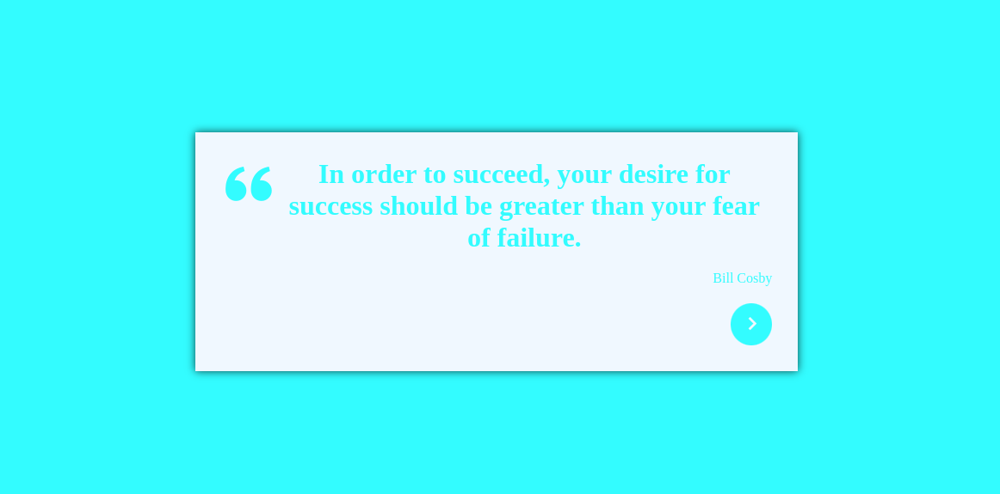

# Frases Random

    

 

## Decripcion

Esta aplicacion muestra frases ramdom cada vez que el usuario presione el boton.

## Funciones o datos del proyecto

- Mas de 100 frases para mostrar.
- El color de fondo cambia al cambiar de frase.

## Link

- https://peppy-jalebi-89e2bc.netlify.app/

## Lenguajes o Herramientas

- HTML
- CSS
- JS
- REACTJS
- JSON

## Autor

** Diego Nieves **

- [LinkedIn](https://www.linkedin.com/in/diego-nieves-04b409242/)
- [Portafolio web](https://nvs-dlc.netlify.app)

## Contactame

Si quieres contactarme puedes escribirme a nieves.diego0426@gmail.com 👍.

  

    

